# scitex-genai

<p align="center">
  <a href="https://scitex.ai">
    
  </a>
</p>

<p align="center"><b>Modality-organised generative-AI provider abstraction for scientific research.</b></p>

<p align="center">
  <a href="https://scitex-genai.readthedocs.io/">Full Documentation</a> · <code>pip install scitex-genai</code>
</p>

<!-- scitex-badges:start -->
<p align="center">
  <a href="https://pypi.org/project/scitex-genai/"></a>
  <a href="https://pypi.org/project/scitex-genai/"></a>
  <a href="https://github.com/ywatanabe1989/scitex-genai/actions/workflows/test.yml"></a>
  <a href="https://codecov.io/gh/ywatanabe1989/scitex-genai"></a>
  <a href="https://scitex-genai.readthedocs.io/en/latest/"></a>
  <a href="https://www.gnu.org/licenses/agpl-3.0"></a>
</p>
<!-- scitex-badges:end -->

---

## Problem and Solution

| # | Problem | Solution |
|---|---------|----------|
| 1 | **Per-provider boilerplate** — every project re-writes thin wrappers around `openai`, `anthropic`, `google.genai`, `groq`, etc., each with subtly different cost / streaming / history semantics. | **Unified `GenAI` factory** — same call shape across OpenAI, Anthropic, Google, Groq, DeepSeek, Perplexity, Llama. Cost tracking, conversation history, and message formatting are provider-agnostic. |
| 2 | **Modality fragmentation** — generative AI is splintering by modality (text, agents, image, audio, video, embeddings, multimodal); ad-hoc namespaces age badly. | **Modality-organised layout** — `scitex_genai.{llm,agent,image,audio,video,embed,multimodal}` is the public top-level shape from day one. Reserved namespaces import successfully but raise `NotImplementedError` until features land, so import paths never need to migrate. |
| 3 | **Heavy LLM SDKs leak into ML workflows** — pulling in `scikit-learn` shouldn't pull `openai` and friends, and vice versa. | **Split package** — classical / deep ML lives in [`scitex-ml`](https://github.com/ywatanabe1989/scitex-ml); `scitex-genai` carries only generative-AI deps. |
| 4 | **Future-proofing for litellm + Ollama** — locking the public API to one provider SDK closes off cheap routing improvements. | **Litellm-ready façade** — the planned `llm` rewrite routes through [litellm](https://github.com/BerriAI/litellm), giving 100+ providers with one OpenAI-compatible interface (Ollama is just `model="ollama/llama3"`) without changing the `GenAI(...)` call surface. |

## Installation

```bash
pip install scitex-genai            # core (LLM providers)
pip install scitex-genai[agent]     # + claude-agent-sdk (forthcoming `agent` submodule)
pip install scitex-genai[litellm]   # + litellm router (preview)
pip install scitex-genai[ollama]    # + local ollama
pip install scitex-genai[all]       # everything available today
```

Through the umbrella: `pip install scitex[genai]`. Requires Python ≥ 3.10.

## Quick Start

```python
import scitex_genai

ai = scitex_genai.GenAI(model="gpt-4o-mini")
print(ai("Explain neural networks in one sentence."))
print("cost USD:", ai.cost)

# Switch backends without changing the call shape:
ai = scitex_genai.GenAI(model="claude-sonnet-4-6")
ai("Same call, different provider.")
```

For a runnable walk-through see [`examples/01_genai.ipynb`](examples/01_genai.ipynb).

## Demo

A runnable provider walk-through (init `GenAI`, single completion, cost
summary, provider switch) lives in
[`examples/01_genai.ipynb`](examples/01_genai.ipynb). Each cell skips
gracefully when the relevant API key is unset.

```mermaid
flowchart LR
    User[your code] -->|GenAI&#40;model&#41;| Factory[scitex_genai.llm.GenAI]
    Factory -->|dispatch| OpenAI[OpenAI]
    Factory --> Anthropic[Anthropic]
    Factory --> Google[Google]
    Factory --> Groq[Groq]
    Factory --> DeepSeek[DeepSeek]
    Factory --> Perplexity[Perplexity]
    Factory --> Llama[Llama]
    OpenAI -.->|tokens / cost| Tracker[BaseGenAI<br/>cost + history]
    Anthropic -.-> Tracker
    Google -.-> Tracker
    Groq -.-> Tracker
    Tracker --> Out[ai&#40;...&#41; · ai.cost · ai.history]
```



A second `examples/example_genai.py` runs the same flow as a script and
is wired into `tests/examples/test_example_genai.py` for CI smoke
coverage.

## Architecture

`scitex-genai` is organised top-down by **modality**, not by provider:

```
scitex-python (umbrella)
    └── scitex.genai ── thin sys.modules-aliasing shim
                        └── scitex_genai (this package)
                              ├── llm/         provider factory ``GenAI``
                              │                 ├── _BaseGenAI         common interface
                              │                 ├── _OpenAI / _Anthropic / _Google /
                              │                 │   _Groq / _DeepSeek / _Perplexity / _Llama
                              │                 ├── _PARAMS            model catalogue
                              │                 ├── _calc_cost         token-cost accounting
                              │                 └── _format_output_func text/markdown formatting
                              ├── agent/        reserved (claude-agent-sdk wrapper planned)
                              ├── image/        reserved
                              ├── audio/        reserved
                              ├── video/        reserved
                              ├── embed/        reserved
                              └── multimodal/   reserved
```

Reserved modality namespaces import successfully but raise
`NotImplementedError` on attribute access, so the public import paths
are stable as features land. Provider SDKs (`openai`, `anthropic`,
`google-genai`, `groq`) are eager core dependencies today; a follow-up
will route `llm/` through [litellm](https://github.com/BerriAI/litellm)
to demote them to optional and add Ollama out of the box.

## Modality layout

| Submodule                   | Status        | Notes                                                |
| --------------------------- | ------------- | ---------------------------------------------------- |
| `scitex_genai.llm`          | ✅ implemented | Provider factory `GenAI`. Litellm-backed in a follow-up. |
| `scitex_genai.agent`        | 🔒 reserved    | Wrapper over `claude-agent-sdk` and friends planned. |
| `scitex_genai.image`        | 🔒 reserved    | Image generation / editing.                          |
| `scitex_genai.audio`        | 🔒 reserved    | TTS / STT / music.                                   |
| `scitex_genai.video`        | 🔒 reserved    | Video generation.                                    |
| `scitex_genai.embed`        | 🔒 reserved    | Embeddings.                                          |
| `scitex_genai.multimodal`   | 🔒 reserved    | Any-to-any unified models.                           |

Reserved namespaces import successfully but raise `NotImplementedError` on attribute access — import paths are stable as features land.

## 4 Interfaces

<details open>
<summary><strong>Python API ⭐⭐⭐ (primary)</strong></summary>

```python
from scitex_genai import GenAI

ai = GenAI(model="gpt-4o-mini")
print(ai("..."))
print("cost USD:", ai.cost)
```

> **[Full API reference](https://scitex-genai.readthedocs.io/en/latest/api.html)**
</details>

<details>
<summary><strong>CLI ⭐ — none</strong></summary>

`scitex-genai` ships no dedicated CLI. Drive completions from Python or use the umbrella `scitex` CLI.
</details>

<details>
<summary><strong>MCP ⭐ — none</strong></summary>

No MCP server in this package today. The umbrella surfaces LLM-related MCP tools separately.
</details>

<details>
<summary><strong>Skills ⭐⭐</strong></summary>

Skill index for AI agents lives at [`src/scitex_genai/_skills/scitex-genai/SKILL.md`](src/scitex_genai/_skills/scitex-genai/SKILL.md). Sub-skill `llm.md` documents the provider factory.

> **[Full skills directory](https://github.com/ywatanabe1989/scitex-genai/tree/develop/src/scitex_genai/_skills/scitex-genai)**
</details>

## Part of SciTeX

`scitex-genai` is part of [**SciTeX**](https://scitex.ai). Install via the umbrella with `pip install scitex[genai]` to use as `scitex.genai` (Python).

```python
import scitex

scitex.genai.GenAI  # same object as scitex_genai.GenAI
scitex.genai.llm    # same object as scitex_genai.llm
```

`scitex.genai` delegates to `scitex_genai` — they share the same API.

The SciTeX system follows the Four Freedoms for Research below, inspired by [the Free Software Definition](https://www.gnu.org/philosophy/free-sw.en.html):

>Four Freedoms for Research
>
>0. The freedom to **run** your research anywhere — your machine, your terms.
>1. The freedom to **study** how every step works — from raw data to final manuscript.
>2. The freedom to **redistribute** your workflows, not just your papers.
>3. The freedom to **modify** any module and share improvements with the community.
>
>AGPL-3.0 — because we believe research infrastructure deserves the same freedoms as the software it runs on.

---

<p align="center">
  <a href="https://scitex.ai" target="_blank"></a>
</p>
