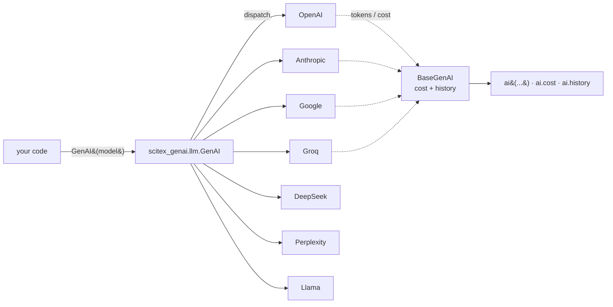
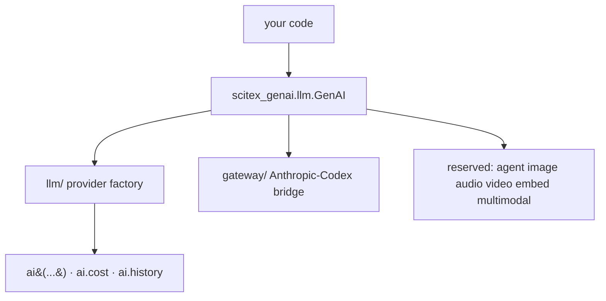

# SciTeX GenAI (<code>scitex-genai</code>)

<p align="center">
  <a href="https://scitex.ai">
    
  </a>
</p>

<p align="center"><b>Modality-organised generative-AI provider abstraction for scientific research.</b></p>

<p align="center">
  <a href="https://scitex-genai.readthedocs.io/">Full Documentation</a> · <code>uv pip install scitex-genai[all]</code>
</p>

<!-- scitex-badges:start -->
<p align="center">
  <a href="https://pypi.org/project/scitex-genai/"></a>
  <a href="https://pypi.org/project/scitex-genai/"></a>
  <a href="https://scitex-genai.readthedocs.io/en/latest/"></a>
</p>
<p align="center">
  <a href="https://github.com/ywatanabe1989/scitex-genai/actions/workflows/pytest-matrix-on-ubuntu-py3-11-3-12-3-13.yml"></a>
  <a href="https://github.com/ywatanabe1989/scitex-genai/actions/workflows/import-smoke-on-ubuntu-py3-12.yml"></a>
  <a href="https://github.com/ywatanabe1989/scitex-genai/actions/workflows/scitex-genai-quality-audit-on-ubuntu-latest.yml"></a>
  <a href="https://codecov.io/gh/ywatanabe1989/scitex-genai"></a>
</p>
<!-- scitex-badges:end -->

---

## Problem and Solution

| # | Problem | Solution |
|---|---------|----------|
| 1 | **Per-provider boilerplate** — every project re-writes thin wrappers around `openai`, `anthropic`, `google.genai`, `groq`, etc., each with subtly different cost / streaming / history semantics. | **Unified `GenAI` factory** — same call shape across OpenAI, Anthropic, Google, Groq, DeepSeek, Perplexity, Llama. Cost tracking, conversation history, and message formatting are provider-agnostic. |
| 2 | **Modality fragmentation** — generative AI is splintering by modality (text, agents, image, audio, video, embeddings, multimodal); ad-hoc namespaces age badly. | **Modality-organised layout** — `scitex_genai.{llm,…,multimodal}` is the public shape from day one; reserved namespaces raise `NotImplementedError` until features land. |
| 3 | **Heavy SDKs in ML workflows** — pulling `scikit-learn` shouldn't pull `openai` and friends, or vice versa. | **Split package** — classical / deep ML lives in [`scitex-ml`](https://github.com/ywatanabe1989/scitex-ml); `scitex-genai` carries only generative-AI deps. |
| 4 | **Future-proofing for litellm + Ollama** — locking the public API to one provider SDK closes off cheap routing improvements. | **Litellm-ready façade** — a planned `llm` rewrite routes through [litellm](https://github.com/BerriAI/litellm) for 100+ providers behind the same `GenAI(...)` call surface. |

## Quick Start

```python
import scitex_genai

ai = scitex_genai.GenAI(model="gpt-4o-mini")
print(ai("Explain neural networks in one sentence."))
print("cost USD:", ai.cost)

# Switch backends without changing the call shape:
ai = scitex_genai.GenAI(model="claude-sonnet-4-6")
ai("Same call, different provider.")
```

For a runnable walk-through see [`examples/01_genai.ipynb`](examples/01_genai.ipynb).

## Demo

A runnable provider walk-through (init `GenAI`, single completion, cost
summary, provider switch) lives in
[`examples/01_genai.ipynb`](examples/01_genai.ipynb). Each cell skips
gracefully when the relevant API key is unset.


```mermaid
flowchart LR
    User[your code] -->|GenAI&#40;model&#41;| Factory[scitex_genai.llm.GenAI]
    Factory -->|dispatch| OpenAI[OpenAI]
    Factory --> Anthropic[Anthropic]
    Factory --> Google[Google]
    Factory --> Groq[Groq]
    Factory --> DeepSeek[DeepSeek]
    Factory --> Perplexity[Perplexity]
    Factory --> Llama[Llama]
    OpenAI -.->|tokens / cost| Tracker[BaseGenAI<br/>cost + history]
    Anthropic -.-> Tracker
    Google -.-> Tracker
    Groq -.-> Tracker
    Tracker --> Out[ai&#40;...&#41; · ai.cost · ai.history]
```

<p align="center"><sub><b>Figure 1.</b> Provider dispatch: one <code>GenAI(model)</code> call shape routes to any supported LLM backend, with token usage and cost tracked per call.</sub></p>

A second `examples/example_genai.py` runs the same flow as a script and
is wired into `tests/examples/test_example_genai.py` for CI smoke
coverage.

## Installation

```bash
uv pip install "scitex-genai[all]"
```

Through the umbrella: `uv pip install "scitex[genai]"`. Requires Python ≥ 3.10.

<details>
<summary><b>Per-extra installs</b></summary>

<br>

| Extra | Pulls in |
|---|---|
| `agent` | `claude-agent-sdk` (forthcoming `agent` submodule) |
| `litellm` | `litellm` router (preview) |
| `gateway` | Anthropic-compatible model gateway (`fastapi`, `uvicorn`) |
| `ollama` | local `ollama` |
| `serve` | local model serving (`scitex-hpc`) |
| `benchmark` | SGLang A/B harness (`httpx`) |
| `image` | image payload helpers (`Pillow`) |

</details>

### Claude Code with a Codex subscription backend

The gateway keeps Claude Code as the agent harness. It translates only the
model protocol and never executes tools returned by Codex.

```bash
export SCITEX_GENAI_GATEWAY_API_KEY="$(openssl rand -hex 32)"
scitex-genai-gateway --host 127.0.0.1 --port 8765
```

By default the gateway discovers
`~/.scitex/agent-container/accounts/openai/*/auth.json`. Set the
path-separated `SCITEX_GENAI_CODEX_HOMES` only to override that store. Each
configured directory contains an `auth.json` created by `codex login`.
Tokens remain in those files and are refreshed atomically. Account selection
is sticky per session, ranks accounts by Codex usage-window headroom, spreads
concurrent sessions, and rotates away from rate-limited accounts. The rotation
selector is invoked even for a one-account pool.

Point Claude Code at the service without changing its hooks, skills, tools, or
project instructions:

```bash
export ANTHROPIC_BASE_URL="http://127.0.0.1:8765"
export ANTHROPIC_API_KEY="$SCITEX_GENAI_GATEWAY_API_KEY"
export ANTHROPIC_MODEL="gpt-5.4"
claude
```

This integration uses the Codex client subscription transport rather than the
separately billed OpenAI API. See the gateway skill for its protocol coverage
and operational limitations.

## Architecture

`scitex-genai` is organised top-down by **modality**, not by provider —
one `GenAI(model)` call shape dispatches to any LLM backend, cost and
history tracked centrally (Figure 1).


```mermaid
flowchart TB
    User[your code] --> GenAI[scitex_genai.llm.GenAI]
    GenAI --> LLM[llm/ provider factory]
    GenAI --> GW[gateway/ Anthropic-Codex bridge]
    GenAI --> RSV[reserved: agent image audio video embed multimodal]
    LLM --> Out[ai&#40;...&#41; · ai.cost · ai.history]
```

<p align="center"><sub><b>Figure 2.</b> Package layout by modality: the implemented <code>llm</code> factory and <code>gateway</code> bridge plus reserved namespaces that raise <code>NotImplementedError</code> until features land.</sub></p>

Reserved modality namespaces import successfully but raise
`NotImplementedError` on attribute access, so the public import paths
are stable as features land. Provider SDKs (`openai`, `anthropic`,
`google-genai`, `groq`) are eager core dependencies today; a follow-up
will route `llm/` through [litellm](https://github.com/BerriAI/litellm)
to demote them to optional and add Ollama out of the box.

## Modality layout

<p align="center"><sub><b>Table 1.</b> Submodule status: implemented, reserved, and planned namespaces.</sub></p>

| Submodule | Status | Notes |
| --------------------------- | ------------- | ---------------------------------------------------- |
| `scitex_genai.llm`          | ✅ implemented | Provider factory `GenAI`. Litellm-backed in a follow-up. |
| `scitex_genai.agent`        | 🔒 reserved    | Wrapper over `claude-agent-sdk` and friends planned. |
| `scitex_genai.image`        | 🔒 reserved    | Image generation / editing.                          |
| `scitex_genai.audio`        | 🔒 reserved    | TTS / STT / music.                                   |
| `scitex_genai.video`        | 🔒 reserved    | Video generation.                                    |
| `scitex_genai.embed`        | 🔒 reserved    | Embeddings.                                          |
| `scitex_genai.multimodal`   | 🔒 reserved    | Any-to-any unified models.                           |

Reserved namespaces import successfully but raise `NotImplementedError` on attribute access — import paths are stable as features land.

## 4 Interfaces

<details open>
<summary><strong>Python API ⭐⭐⭐ (primary)</strong></summary>

```python
from scitex_genai import GenAI

ai = GenAI(model="gpt-4o-mini")
print(ai("..."))
print("cost USD:", ai.cost)
```

> **[Full API reference](https://scitex-genai.readthedocs.io/en/latest/api.html)**
</details>

<details>
<summary><strong>CLI ⭐ — gateway</strong></summary>

`scitex-genai-gateway` serves an authenticated Anthropic-compatible endpoint
backed by one or more Codex subscription accounts.
</details>

<details>
<summary><strong>MCP ⭐ — none</strong></summary>

No MCP server in this package today. The umbrella surfaces LLM-related MCP tools separately.
</details>

<details>
<summary><strong>Skills ⭐⭐</strong></summary>

Skill index for AI agents lives at [`src/scitex_genai/_skills/scitex-genai/SKILL.md`](src/scitex_genai/_skills/scitex-genai/SKILL.md). Sub-skill `llm.md` documents the provider factory.

> **[Full skills directory](https://github.com/ywatanabe1989/scitex-genai/tree/develop/src/scitex_genai/_skills/scitex-genai)**
</details>

## Part of SciTeX

`scitex-genai` is part of [**SciTeX**](https://scitex.ai). Install via the umbrella with `pip install scitex[genai]` to use as `scitex.genai` (Python).

```python
import scitex

scitex.genai.GenAI  # same object as scitex_genai.GenAI
scitex.genai.llm    # same object as scitex_genai.llm
```

`scitex.genai` delegates to `scitex_genai` — they share the same API.

The SciTeX system follows the Four Freedoms for Research below, inspired by [the Free Software Definition](https://www.gnu.org/philosophy/free-sw.en.html):

>Four Freedoms for Research
>
>0. The freedom to **run** your research anywhere — your machine, your terms.
>1. The freedom to **study** how every step works — from raw data to final manuscript.
>2. The freedom to **redistribute** your workflows, not just your papers.
>3. The freedom to **modify** any module and share improvements with the community.
>
>AGPL-3.0 — because we believe research infrastructure deserves the same freedoms as the software it runs on.

---

<p align="center">
  <a href="https://scitex.ai" target="_blank"></a>
</p>
